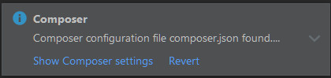
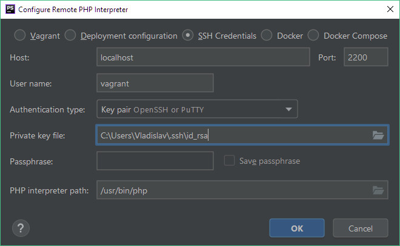
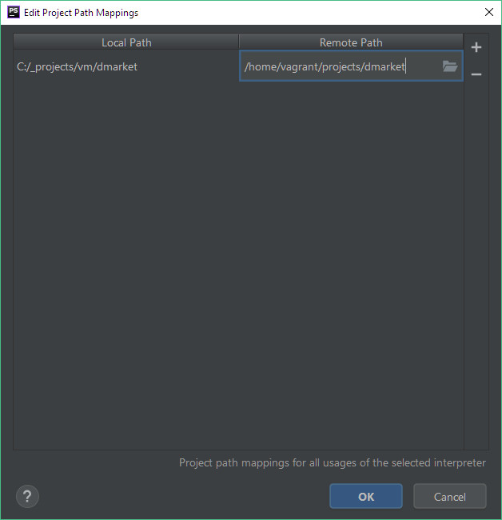

# Configuring Project Hosted On Virtual Machine #

{{ toc }}

## Open Project ##

1. Open menu `File` -> `New Project From Existing Files`.
2. Pick first option `Web server is installed locally, source files are located under its document root` and press `Next`:

    
 
3. Pick project directory and press `Next`.
4. Pick `Add new local server` and press `Next`.
5. Enter unique name into `Name`, base URL into `Web server URL` and check `Don't check HTTP connection to server`:

    

6. Leave `Web path for project root` empty and press `Finish`.
7. If you see Composer integration notice, press `Revert` on it:
 
    

## Exclude Generated Files ##

1. Open menu `File` -> `Settings` -> `Directories`.
2. Right-click `public/development` and `temp/development` directories and mark them as `Excluded`.
3. Press `Apply` and `OK`.
 
> **Note**. Later, after using `testing` and `production environment` mark `public/testing`, `public/web`, `public/backend`, `public/frontend`, `temp/testing`, `temp/production` directories as excluded as well.
 
## Add Package Git Repository And Directories ##

You'll do most of development inside your Composer package. We haven't covered package creation yet, after we do, configure your package in PHPStorm as described in this section.

First, configure Git integration:

1. Open menu `File` -> `Settings` -> `Version Control`.
2. Press `+`.
3. Pick `vendor/[vendor_name]/[package_name]` directory under project path.
4. Press, `OK`, `OK`, `Apply`, `OK`.

Next, configure directories:

1. Open menu `File` -> `Settings` -> `Directories`.
2. Right-click `vendor/[vendor_name]/[package_name]/src` directory and mark it as `Sources`.
    1. Click on pencil icon in right pane near newly added directory under `Source Folders`.
    2. Enter package PHP namespace for that directory ending with `\` into `Package prefix` and press `OK`. 
3. Right-click `vendor/[vendor_name]/[package_name]/samples` directory and mark it as `Sources`.
    1. Click on pencil icon in right pane near newly added directory under `Source Folders`.
    2. Enter package PHP namespace for that directory ending with `\Samples\` into `Package prefix` and press `OK`. 
4. Right-click `vendor/[vendor_name]/[package_name]/tests` directory and mark it as `Tests`.
    1. Click on pencil icon in right pane near newly added directory under `Test Folders`.
    2. Enter package PHP namespace for that directory ending with `\Tests\` into `Package prefix` and press `OK`. 
5. Press `Apply` and `OK`.

## Configure Debugging ##

First, configure command-line interpreter:

1. Open menu `File` -> `Settings` -> `Languages and Frameworks` -> `PHP`.
2. Pick `PHP Language Level` = `7.1`.
3. Press `...` near `CLI Interpreter`.
4. Press `+`, pick `From Docket, Vagrant, VM, Remote`.
5. Pick `SSH Credentials` and enter SSH credentials:
       
    

6. Rename newly created interpreter configuration to your project name and press `Apply` and `OK`.
7. Click folder icon near `Path mappings`.
8. Click `+`, enter local project path and project path on virtual machine and press `OK`:

    

9. Press `Apply` and `OK`.

Finally, configure PHPUnit:

1. In project directory, run `php run config:phpunit` command.
2. Open menu `File` -> `Settings` -> `Languages and Frameworks` -> `Test Frameworks`.
3. Press `+`, pick `PHPUnit by Remote Interpreter` and pick command-line interpreter you configured for this project.
4. Pick `phpunit.xml` from project directory as configuration file and press `Apply` and `OK`.