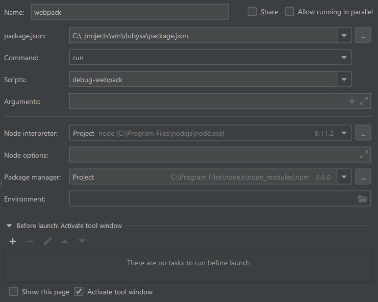

# Excerpts #

This section contains excerpts of various documentation topics. With time, these topics will find their place in official documentation. This section doesn't have any specific order of topics. 

## Designing For Primary And Secondary Colors ##

Every UI component may be of some predefined color - primary color, secondary color or one of dark/light variations - by default, of primary color. More on colors in `vendor/dubysa/components/src/Ui/Aba/resources/css/_variables.scss`. 

To implement that, CSS styles of UI component are colorless and contain the following code snippet in the end of style sheet (example from `vendor/dubysa/components/src/Ui/PopupMenus/resources/css/styles.scss`):

      @include popup-menu-color($color--primary, $color--on-primary);
      &.-light {
        @include popup-menu-color($color--primary-light, $color--on-primary-light);
      }
      &.-dark {
        @include popup-menu-color($color--primary-dark, $color--on-primary-dark);
      }
      
      &.-secondary {
        @include popup-menu-color($color--secondary, $color--on-secondary);
        &.-light {
          @include popup-menu-color($color--secondary-light, $color--on-secondary-light);
        }
        &.-dark {
          @include popup-menu-color($color--secondary-dark, $color--on-secondary-dark);
        }
      }

## Useful Command-Line Utlities ##

    # tell PHPStorm to resolve SASS imports - use when working on CSS styles
    php run config:phpstorm css

    # tell PHPStorm to resolve JS imports - use when working on JS code
    php run config:phpstorm

## MACAW ##

MACAW stands for Model - Action - Controller - Action - vieW. These concept and responsibilities are described in `vendor/dubysa/components/src/Framework/Js/resources/js/Macaw.js`. Below are some practical tips.

Controllers are bound to elements in `js/index.js` file. One of 2 syntaxes are used:

    import macaw from 'Manadev_Framework_Js/vars/macaw';

    // bind to all elements having specified ViewModel class
    macaw.controller(Manadev_Samples_Ui.TestSnackBar, TestSnackBar);

    // bind to all elements matching specified CSS selector
    macaw.controller('.test-popup-menu', SampleViewUsingPopupMenu);

All controllers attached to element (view) can be seen in Inspect Element -> Properties -> [first item, reading like `div.test-popup-menu`] -> m_controllers.

## Debugging WebPack ##

1. In PHPStorm, only scripts starting with `node` can be debugged.
2. In Windows, `%NODE_DEBUG_OPTION%` placeholder should be added just after `node` (`$NODE_DEBUG_OPTION` in other platforms).

In Windows, add an script entry to be used for debugging, directly in `package.json`:

    "debug-webpack": "node %NODE_DEBUG_OPTION% node_modules/webpack/bin/webpack.js --config vendor/dubysa/components/src/Framework/WebPack/webpack.config.js --env.APP_ENV=testing"

In PHPStorm -> Run -> Edit Configurations, add new `npm` configuration:

Set up a breakpoint, For starters, in the end of `buildTarget()` method in `vendor/dubysa/components/src/Framework/WebPack/webpack.config.js` file, to check final generated WebPack configuration.

Run `debug-webpack` script by pressing `F5` and picking `webpack` configuration from list.

After debugging is finished, generate `package.json` anew to remove your debug script entry from it with:

    php run config:npm 