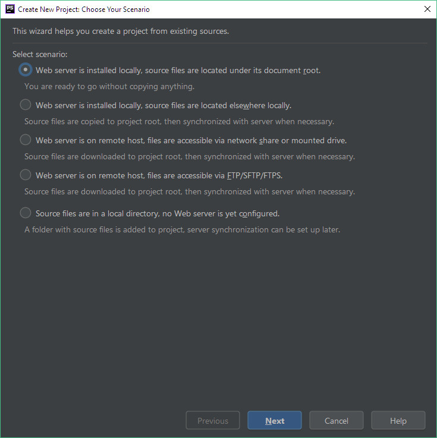
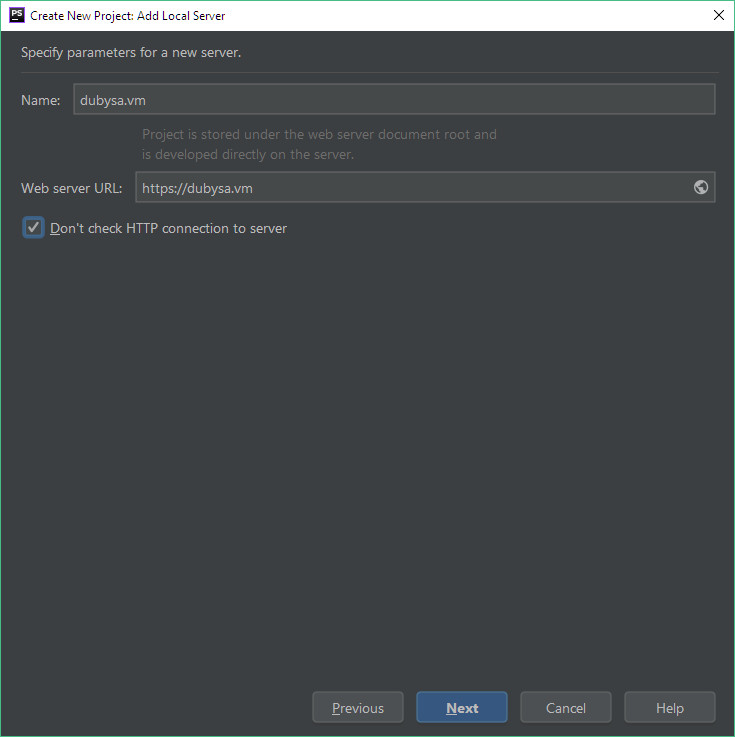

# Opening Project Hosted on Vagrant And Using HTTPS #

1. Open menu `File` -> `New Project From Existing Files`.
2. Pick first option `Web server is installed locally, source files are located under its document root` and press `Next`:

    

3. Pick `{project_dir}` and press `Next`.
4. Pick `Add new local server` and press `Next`.
5. Enter `{project_domain}` into `Name`, `https://{project_domain}` into `Web server URL` and check `Don't check HTTP connection to server`:

    

6. Leave `Web path for project root` empty and press `Finish`.
7. If you see Composer integration notice, press `Revert` on it:

    

