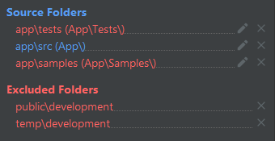

# Excluding Generated Files From Index #

PHPStorm indexes all files for search and auto-completion. It doesn't make sense to index files which are generated by the application and are temporary in nature. You can exclude generated files from PHPStorm index as shown below:

1. Open menu `File` -> `Settings` -> `Directories`.

2. Right-click `public/development` and `temp/development` directories and mark them as `Excluded`. you should see whole directory list in the right pane as follows:

    

3. Press `Apply` and `OK`.

## Using Other Environments ##

After using `testing` environment also mark the following directories as excluded:

* `public/testing`,
* `temp/testing`,

After using `production` environment also mark the following directories as excluded:

* `public/web`,
* `public/backend`,
* `public/frontend`,
* `temp/production`.
