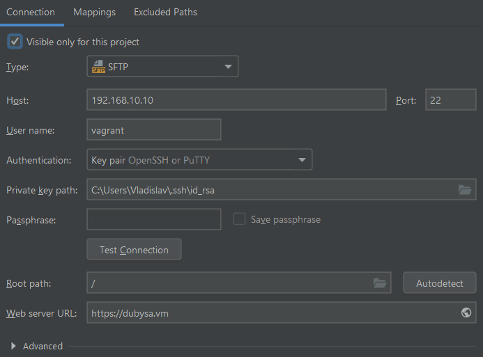
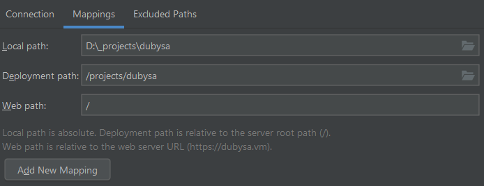
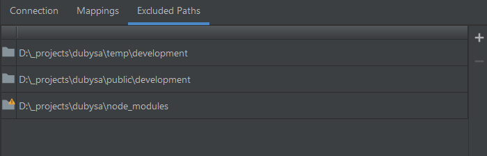

# Deploying Project Files To Vagrant Using SFTP #

1. Open `File -> Settings -> Build, Execution, Deployment -> Deployment`.
 
2. Select `{project_domain}` and fill in first tab as shown below:

	 

3. Press `Test Connection` to make sure all settings are entered correctly.

4. Press `Apply`, open `Mappings` tab and fill it in with local and remote project path:

	 

5. Add `temp/development`, `public/development` and `node_modules` directories to `Excluded Paths` tab using `Plus Button -> Local Path` command:

	 

6. Press `Apply`

7. Open `Build, Execution, Deployment -> Deployment -> Options`, set `Upload changed files automatically to default server` to `Always`.
 
8. Press `Apply` and `OK`.

9. Right-click project directory and run `Deployment -> Upload To {project_domain}`.

## Using Other Environments ##

After using `testing` environment add the following directories to excluded paths:

* `public/testing`,
* `temp/testing`,

After using `production` environment add the following directories to excluded paths:

* `public/web`,
* `public/backend`,
* `public/frontend`,
* `temp/production`.
