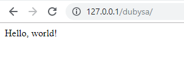

# "Hello, World!"

{{ toc }}

## Introduction 

In this tutorial you will create the first simple web application with Dubysa framework showing "Hello world!".

<http://127.0.0.1/dubysa/> 
  

You will learn about 

- creating the project,
- local web server configuration,
- HTTP requests, routes and controllers.

>**IMPORTANT:** Before you begin, [prepare your computer](../introduction/preparing-your-computer.html).

## Creating New Project 

Choose or create a directory where you develop all your projects.

>**NOTE:** If you are on Linux, let's assume it is `/projects`, for Windows it would be `c:\projects`.

First, open command-line, go to the root project directory and run Composer command with like in the example below:

    composer create-project -n dubysa/dubysa "--repository={\"type\":\"vcs\",\"url\":\"git@bitbucket.org:dubysa/dubysa.git\"}"

During command execution, 

 - project files are downloaded from the repository and copied locally into `dubysa` subdirectory,
 - Composer downloads latest version of all dependent packages,
 - Dubysa post-update scripts are executed and environment is configured.
 
You can read more about how to [customize project creation](../php-development/dubysa-console-commands.html#composer-create-project).

## Configuring Local Web Server ##

Before Local web server is configured, the browser does not know how to process <http://127.0.0.1/dubysa/> and 
shows *"Not Found. The requested URL /dubysa/ was not found on this server."*

Local web server is going to process <http://127.0.0.1/dubysa/>  browser request from `/projects/dubysa/public`.

For production environment virtual host can be configured, but for development, in case of Windows and Apache web server, you can just create Windows symbolic link.

**Symbolic link** is a file-system object that points to another file system object. 
In our case, it should be created in Apache default document root directory for our project `public` directory.

To do this first go to Apache default document root directory `htdocs` in command prompt and run `mklink` Windows command.

	mklink /D dubysa c:\projects\dubysa\public

where
 
- `/D` means pointing to directory
- `dubysa` - name of symbolic link
- `c:\projects\dubysa\public` is a `public` directory of our project where symbolic link will point to.

After command is executed, you should see the new directory `dubysa` in Apache document root.  

Also running <http://127.0.0.1/dubysa/>  in the browser address line will show *"Page not found"*.

## Creating New Module ##

In the context of this tutorial we will create one project-specific module `App_Hello`.

>**NOTE:** Dubysa [module](../../architecture/modules/) is a directory which contains 
PHP, JavaScript, CSS and and other files related to specific functionality. 

>There are two types of modules: 

>  - project specific modules, located in `app/src` directory,
>  - reusable modules, used in more than one project, stored in `vendor/dubysa` directory. 

>Each Dubysa module is expected to follow specific 
>[directory structure](../../architecture/modules/#directory-structure). 

Create main module directory `app/src/Hello`.
 
Create new PHP class `App\Hello\Module` (file `app/src/Hello/Module.php`):

	<?php
	
	namespace App\Hello;
	
	use Osm\Core\Modules\BaseModule;
	
	class Module extends BaseModule
	{
	
	} 

## Adding Route Configuration

> **IMPORTANT:** We suggest you get acquainted with [routes](../../web-development/routes/) before you will go further.

Create directory `app/src/Hello/config` - module configuration 
and subdirectory `app/src/Hello/config/frontend` for [`frontend` area](../../web-development/areas/) configuration.

Create PHP file `app/src/Hello/config/frontend/routes.php` to store route configuration and add `'GET /'` route to handle <http://127.0.0.1/dubysa/> homepage URL:

    <?php
    
    use App\Hello\Controllers\Frontend;
    
    return [
        'GET /' => ['class' => Frontend::class, 'method' => 'show'],
    ];

Route configuration file (as any other configuration file) should always return plain PHP array.

In this tutorial we define only one route - to retrieve information from web server for homepage. Here: 

- `GET` - HTTP method. As we noted above most HTTP requests use `GET` HTTP method
- `/` - path to be processed for this route. In this case homepage
- `Frontend::class` is a name of class which should generate response for the route. Note that we [imported this class name](http://php.net/manual/en/language.namespaces.importing.php) with `use App\Docs\Controllers\Frontend` statement 
- `'show'` is a method for page rendering inside the above mentioned class. 

## Creating `Frontend` Controller Class

[Controller](../../web-development/controllers/) is a class for processing browser requests.

Create directory  `app/src/Hello/Controllers` to store source code to handle web requests. 
 
Create PHP class `App\Hello\Controllers\Frontend` mentioned in route configuration. By [convention](#), name of controller class is derived from area name.  

Content of `app/src/Hello/Controllers/Frontend.php`:

    <?php
    
    namespace App\Hello\Controllers;
    
    use Osm\Framework\Http\Controller;
    
    class Frontend extends Controller
    {
        public function show() {
            return 'Hello, world!';
        }
    }

This class has only one public method `show()`, used in route configuration. This controller method returns string which is just rendered as plain text in browser. Please check [other things controller method can do](#).

Conclusion
----------------------------------------

You did it! 
Try to enter <http://127.0.0.1/dubysa/>  in browser address line and check if you see "Hello world!". 
If you do not see expected result, run [`php fresh`](../../php-development/dubysa-console-commands#php-fresh) 
in project directory. 

We propose you to continue with learning Dubysa framework in the next tutorial 
["Flat File Documentation Website"](../flat-file-documentation-website/).
