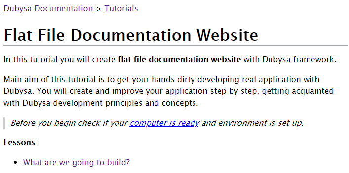

# What Are We Going To Build? #

After you complete all the tutorial lessons, you'll have ready to use flat file documentation system.

## Tutorial Delivery

Assume you have a set of Markdown files on your local PC and you want to create documentation website with:

- responsive design
- automatically generated table of content for a site, chapter or sub-chapter
- working SEO-friendly hyperlinks within the same file, other file or outside website
- images
- breadcrumbs

We are going to create a static web application which presents documentation as a set of related web pages.
It should be easy to maintain the content - refresh a browser page and see the result.
No more additional steps are needed.

*Example of documentation website:*

## Source Documentation Structure:

- Root documentation page accessible by relative URL `/` is displayed from `index.md` file.
- First-level pages (relative URL `/some-page.html`) are displayed from `[N-]some-page.md` file. Here `[N-]` denotes optional number used for sorting in the table of contents.
- Second-level pages `/some-page/child-page.html` are displayed from `some-page/[N-]child-page.md` file.
- Third and greater level pages are organized according second-level page rules.
- Keep image file in the same directory as Markdown file where the image is shown.
- Directory and file names should be in lower case. Only Latin characters, minus sign ("-") and numbers are allowed.

## Example ##

    Relative URL				File name
    ------------------------------------------------------------------
    /							index.md
    some-page.html				01-some-page.md
    some-page/child-page.html	some-page/01-child-page.md
    virtual/page.html			virtual/01-page.md

