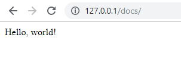

# Lesson 1. Creating Simple Web Application #

In this lesson you will create simple web application which shows static text "Hello world!".

You will learn about 

- creating the project,
- local web server configuration,
- HTTP requests, routes and controllers.

Expected Result
----------------------------------------

After the lesson is finished, URL <http://127.0.0.1/docs/> in browser address should 
get a response from the new application with *"Hello world!"* text:

Steps To Implement:
----------------------------------------

{{ toc }}

>**IMPORTANT:** Before you begin, [prepare your computer](../../introduction/preparing-your-computer.html).

## Creating New Project 

Choose or create a directory where you develop all your projects.

>**NOTE:** In this tutorial we assume `/projects` for Linux, `c:\projects` for Windows.

First, open command-line, go to the root project directory and run Composer command with like in the example below:

    composer create-project -n dubysa/dubysa docs "--repository={\"type\":\"vcs\",\"url\":\"git@bitbucket.org:dubysa/dubysa.git\"}"

During command execution, 

 - project files are downloaded from the repository and copied locally into `docs` subdirectory,
 - Composer downloads latest version of all dependent packages,
 - Dubysa post-update scripts are executed and environment is configured.
 
You can read more about how to [customize project creation](../../php-development/dubysa-console-commands.html#composer-create-project).

## Configuring Local Web Server ##

Before Local web server is configured, the browser does not know how to process `http://127.0.0.1/docs/` and 
shows *"Not Found. The requested URL /docs/ was not found on this server."*

Local web server is going to process `http://127.0.0.1/docs/` request from  `/projects/docs/public`.

For production environment virtual host can be configured, but for development, in case of Windows and Apache web server, you can just create Windows symbolic link.

**Symbolic link** is a file-system object that points to another file system object. 
In our case, it should be created in Apache default document root directory for our project `public` directory.

To do this first go to Apache default document root directory `htdocs` in command prompt and run `mklink` Windows command.

	mklink /D docs c:\projects\docs\public

where
 
- `/D` means pointing to directory
- `docs` - name of symbolic link
- `c:\projects\docs\public` is a `public` directory of our project where symbolic link will point to.

After command is executed, you should see the new directory `docs` in Apache document root.  

Also running `http://127.0.0.1/docs/` in the browser address line will show *"Page not found"*.

## Opening Project In PHPStorm

If you use [PHPStorm](https://www.jetbrains.com/phpstorm/), open the project in it:

- in PHP select menu *File -> New Project from Existing Files*
- choose directory `c:\projects\docs` where the project is installed
- configure web server for PHPStorm (where to send HTTP requests):
	- in *Specify the local server* step select *Add new local server*, 
	- name it `localhost` 
	- enter text `http://127.0.0.1/` in  `Web server URL`
	- *Web path for project root* = `docs`

## Creating New Module ##

In the context of this tutorial we will create one project-specific module `App_Docs`.

>**NOTE:** Dubysa [module](../../architecture/modules/) is a directory which contains 
PHP, JavaScript, CSS and and other files related to specific functionality. 

>There are two types of modules: 

>  - project specific modules, located in `app/src` directory,
>  - reusable modules, used in more than one project, stored in `vendor/dubysa` directory. 

>Each Dubysa module is expected to follow specific 
>[directory structure](../../architecture/modules/#directory-structure). 

Create main module directory `app/src/Docs`.

>**IMPORTANT:** Here and below in all file or directory creation instructions, we will use relative path notation, 
keeping in mind that the base path is the project directory`c:\projects\docs`.
 
Create new PHP class `App\Docs\Module` (file `app/src/Docs/Module.php`):

	<?php
	
	namespace App\Docs;
	
	use Manadev\Core\Modules\BaseModule;
	
	class Module extends BaseModule
	{
	
	} 

## Adding Route Configuration

> **IMPORTANT:** We suggest you get acquainted with [routes](../../web-development/routes/) before you will go further.

Create directory `app/src/Docs/config` - module configuration 
and subdirectory `app/src/Docs/config/frontend` for [`frontend` area](../../web-development/areas/) configuration.

Create PHP file `app/src/Docs/config/frontend/routes.php` to store route configuration and add `'GET /'` route to handle <http://127.0.0.1/docs/> homepage URL:

    <?php
    
    use App\Docs\Controllers\Frontend;
    
    return [
        'GET /' => ['class' => Frontend::class, 'method' => 'show'],
    ];

Route configuration file (as any other configuration file) should always return plain PHP array.

In this tutorial we define only one route - to retrieve information from web server for homepage. Here: 

- `GET` - HTTP method. As we noted above most HTTP requests use `GET` HTTP method
- `/` - path to be processed for this route. In this case homepage
- `Frontend::class` is a name of class which should generate response for the route. Note that we [imported this class name](http://php.net/manual/en/language.namespaces.importing.php) with `use App\Docs\Controllers\Frontend` statement 
- `'show'` is a method for page rendering inside the above mentioned class. 

## Creating `Frontend` Controller Class

[Controller](../../web-development/controllers/) is a class for processing browser requests.

Create directory  `app/src/Docs/Controllers` to store source code to handle web requests. 
 
Create PHP class `App\Docs\Controllers\Frontend` mentioned in route configuration. By [convention](#), name of controller class is derived from area name.  

Content of `app/src/Docs/Controllers/Frontend.php`:

    <?php
    
    namespace App\Docs\Controllers;
    
    use Manadev\Framework\Http\Controller;
    
    class Frontend extends Controller
    {
        public function show() {
            return 'Hello, world!';
        }
    }

This class has only one public method `show()`, used in route configuration. 
This controller method returns string which is just rendered as plain text in browser. 

In future lessons we will add additional functionality to controller to prepare and show full HTML page.
We will add additional functionality to show . 

Please check [other things controller method can do](#).

## Keeping Cache And Assets Up To Date ##

While new folders and files will be added to the project, 
it is often needed to refresh the cache and publish JS/CSS assets. Otherwise browser will just show old content. 

Dubysa provides [`npm run watch`](../../php-development/dubysa-console-commands#npm-run-watch) 
command to refresh PHP cache automatically when something is changed

In command line go to project directory and run  

    npm run watch
  
    
Conclusion
----------------------------------------

You did it! 
Try to enter <http://127.0.0.1/docs/> in browser address line and check if you see "Hello world!". 

