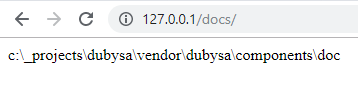

# Lesson 2. Reading Application Configuration #

Flat documentation website needs to know where source documentation files are stored.

In this lesson, we will

- add new setting to store documentation source directory name
- write source code to read this configuration
- display documentation directory on application homepage
 
Expected Result
----------------------------------------

Our website homepage <http://127.0.0.1/docs/> should show documentation directory name:

Steps To Implement:
----------------------------------------

{{ toc }}

 
## Adding Application Configuration ##

Application configuration is a set of parameters and settings, used to affect an application behavior 
without having to change application source code.

Configuration is read from `config` directory of the project and every included module and then merged.
Also, configuration is stored in application cache for quicker access.

Let's create `config/settings.php` file to store `doc_root` setting pointing to the documentation root path.
 
Here is an example of file content (you can set own value to the parameter):
    
    	<?php
    	
    	return [
    	    'doc_root' => 'c:\_projects\dubysa\vendor\dubysa\framework\doc',
    	]; 
    	  

## Modifying `Frontend` Controller Class

We already have [`Frontend` controller](creating-simple-web-application#creating-web-controller-class) 
class which renders application homepage so far, showing static text *"Hello, world!"*. 
  
Let's modify `App\Docs\Controllers\Frontend` class to read `doc_root` configuration parameter value 
and send it to the browser.

Below is the content of `app/src/Docs/Controllers/Frontend.php`:

    <?php
    
    namespace App\Docs\Controllers;
    
    use App\Docs\Hints\SettingsHint;
    use Manadev\Core\App;
    use Manadev\Framework\Http\Controller;
    use Manadev\Framework\Settings\Settings;
    
    /**
     * @property Settings|SettingsHint $settings @required
     * @property string $doc_root @required
     */
    class Frontend extends Controller
    {
        protected function default($property) {
            global $m_app;
            /* @var App $m_app */
    
            switch ($property) {
                case 'settings':
                    return $m_app->settings;
                case 'doc_root':
                    return $this->settings->doc_root;
            }
    
            return parent::default($property);
        }
    
        public function show() {
            return $this->doc_root;
        }
    }

First of all, we introduced two properties `$settings` and `$doc_root` in the class.
We advise to read more about [properties](../../architecture/properties) in Dubysa.

The properties have `@required` notation, that means that application will stop processing 
if any of those properties is not found. 

Values for both properties are set in protected `default()` class function in standard way for 
[properties, calculated on first access (AKA lazy properties)](../../architecture/properties#properties-calculated-on-first-access-aka-lazy-properties). 

To get application settings we are using [`$m_app`](../../architecture/modules/standard-classes-and-objects#$m_app) 
object - global top-level application object of `Manadev\Core\App` class. 

The global `$m_app` variable already has `settings` property to keep and cache all application settings.

The object `$m_app->settings` reads and merges `config/settings.php` files from all included modules and application directory. 
This functionality is provided in standard Dubysa Framework class `Manadev\Framework\Settings\Settings`. 
This class is also responsible for caching.

However, new setting `doc_root`, which we need to process in our application and which should be mandatory and cacheable, is our own custom property. Normally we specify that property is mandatory and cacheable in its class, 
but we cannot modify standard `Manadev\Framework\Settings\Settings` class.
Therefore we need to introduce new class `SettingsHint` in `Docs` module to specify behavior of new `doc_root` property. 
This class will be created in the next section.  

The `doc_root` property value is assigned by fetching `doc_root` property value of `settings` object. 

Finally, we imported those two classes `Manadev\Framework\Settings\Settings` and `App\Docs\Hints\SettingsHint`, 
used for `$settings` property evaluation. 

## Creating `SettingsHint` Class

As we cannot modify standard Dubysa class, we introduce [type hint](../../architecture/type-hints) for it. 

Create directory `app/src/Docs/Hints`. 

Create PHP class `app/src/Docs/Hints/SettingsHint.php`. Here is the content of this class:

    <?php
    
    namespace App\Docs\Hints;
    
    use Manadev\Framework\Settings\Settings;
    
    /**
     * @property string $doc_root @required @part
     */
    abstract class SettingsHint extends Settings
    {
    
    }

Conclusion
----------------------------------------

Now it a time to check if homepage <http://127.0.0.1/docs/> shows documentation directory name.
