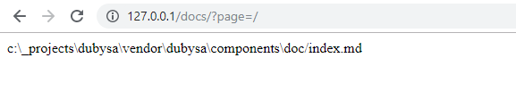
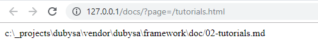
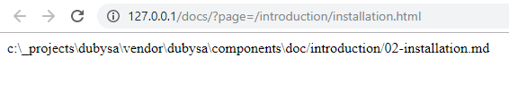

# Lesson 3. Finding Documentation File #

In the previous lesson we had learned how to get source documentation root directory.

Now it's time to find the proper file in this documentation root directory according to HTTP request URL.

In this lesson we will cover some important topics: 

- how to declare HTTP query parameter which is processed in the route 
- how to process this parameter value in controller class
- how to provide user-friendly text on specific exception
- about multi-language support in web application
 
Expected Result
----------------------------------------

In this lesson application should find a file according to provided URL and display file name.
If URL is not fully matched to any file name, the application should show error message.
 
Here are tree possible cases when original Markdown file can be found according to HTTP request:

|HTTP request    |File name ||
:----------- | :------------- | :----------- |
1. Home page | `GET /?page=/`| `index.md` |
2. First-level page	| `GET /?page=/some-page.html` | `[N-]some-page.md` |
3. Second and greater level pages | `GET /?page=/some-page/child-page.html` | `some-page/[N-]child-page.md` |

>**NOTE**: In the example above `[N-] prefix is used in the name of Markdown files. Here [N-] denotes optional number used for sorting the file in the table of contents.

**Examples:**  

 1. **Home page:** <http://127.0.0.1/docs/?page=/> 

 2. **First-level page:**  <http://127.0.0.1/docs/?page=/tutorials.html> 
    

   
 3. **Second=level page:**  <http://127.0.0.1/docs/?page=/tutorials/hello-world.html> 
    

    

Steps To Implement:
----------------------------------------

{{ toc }}

## Adding `page` Parameter Handling To The Route Configuration

According to **[Expected Result](#expected-results)** section we need to process 
[HTTP request](../../web-development/http-requests/), define query parameter `page` and pass its value for further processing.

Let's add this parameter declaration to existing `GET /` route. 

Modify `app/src/Docs/config/frontend/routes.php` file content as shown below:

    <?php
    
    use App\Docs\Controllers\Frontend;
    use Osm\Framework\Http\Parameters;
    
    return [
        'GET /' => [
            'class' => Frontend::class,
            'method' => 'show',
            'parameters' => [
                'page' => [
                    'class' => Parameters\String_::class,
                    'required' => true,
                ],
            ],
        ],
    ];

This declaration says that we expect `page` [HTTP query parameter](#) to be any string and that this parameter is mandatory.

## Processing `page` Parameter And Finding The File

Now we need to add the logic to `App\Docs\Controllers\Frontend` class to find a file matching incoming `page` parameter value and display the name of the found file.

Here is updated content of `app/src/Docs/Controllers/Frontend.php` file:

    <?php
    
    namespace App\Docs\Controllers;
    
    use App\Docs\Hints\SettingsHint;
    use Osm\Core\App;
    use Osm\Framework\Http\Controller;
    use Osm\Framework\Settings\Settings;
    use Osm\Framework\Http\Exceptions\NotFound;
    
    /**
     * @property Settings|SettingsHint $settings @required
     * @property string $doc_root @required
     * @property string $url @required
     */
    class Frontend extends Controller
    {
        protected function default($property) {
            global $osm_app; /* @var App $osm_app */
    
            switch ($property) {
                case 'settings':
                    return $osm_app->settings;
                case 'doc_root':
                    return $this->settings->doc_root;
                case 'url':
                    return $osm_app->query['page'];
            }
    
            return parent::default($property);
        }
    
        public function show() {
            return $this->findFile();
        }
    
        protected function findFile() {
            // read incoming query parameter 'page'
            $url = $this->url;
    
            if ($url === '/') {
                // home page is rendered from 'index.md'
                if (is_file($filename = $this->doc_root . '/index.md')) {
                    return $filename;
                }
            }
    
            if (mb_strrpos($url, '.html') !== mb_strlen($url) - mb_strlen('.html')) {
                // if page URL doesn't end with configured '.html' suffix, show that page is not found
                throw new NotFound(m_("Documentation page ':page' not found", ['page' => $this->url]));
            }
    
            // page URL ends with '.html' suffix. Remove suffix from URL
            $url = mb_substr($url, 0, mb_strlen($url) - mb_strlen('.html'));
    
            // handle page path. There should always be at least one '/' in URL as all page URLs start with '/'.
    
            // find position of last '/' in URL and define path and filename
            $pos = mb_strrpos($url, '/');
            $path = $this->doc_root . mb_substr($url, 0, $pos);
            $filename = mb_substr($url, $pos + 1);
    
            // if path is not a directory or filename is empty, show that page is not found
            if (!is_dir($path) || !$filename) {
                throw new NotFound(m_("Documentation page ':page' not found", ['page' => $this->url]));
            }
    
            // iterate through all files in 'path' directory and find file with or without preceding sort order.
            foreach (new \DirectoryIterator($path) as $fileInfo) {
                // skip '.' and '..' directory items
                if ($fileInfo->isDot() || $fileInfo->isDir()) {
                    continue;
                }
    
                if (preg_match("/(?:\\d+-)?" . preg_quote($filename) . "\\.md/u", $fileInfo->getFilename())) {
                    return "{$path}/{$fileInfo->getFilename()}";
                }
            }
    
            // If underlying directory doesn't exist we return that page doesn't exist
            throw new NotFound(m_("Documentation page ':page' not found", ['page' => $this->url]));
        }
    }
  
First of all, you see that we've introduced a new property `url` inside the class.
Properties are the class variables, and it is convenient to introduce them when the value 
should be accessed multiple times. 
In Dubysa it is common to use [properties, calculated on first access (AKA lazy properties)](../../architecture/properties#properties-calculated-on-first-access-aka-lazy-properties).

After HTTP route is processed, all query parameters are stored in `query` property of 
[global application object `$osm_app`](../../architecture/modules/standard-classes-and-objects#$osm_app).

Property `page` value is retrieved from array of preprocessed HTTP query parameters by parameter name: `$osm_app->query['page']`.

The main logic of finding documentation file by `page` parameter value is implemented in `findFile()` function.
We are processing all possible patterns of finding the file described above.

In case file is not found by all three patterns, we are throwing `NotFound` exception. 
Full name of this class `Osm\Framework\Http\Exceptions\NotFound` is imported in the beginning of the file. 

Note that exception text has a placeholder for `page` parameter which is replaced by `page` parameter value.  

The last thing to pay attention here is `m_` function which   
[picks the message translated to current language](../../php-development/multilanguage-support/). 

## Adding Translation For `en_US` Locale

Since we start using `m_` function for [multilanguage support](../../php-development/multilanguage-support/), 
we need to create a file to store translation for default `en_US` locale.

If you are developing a multi-language application, after development is finished, 
you can translate this file to all supported languages. 

First of all, create `translations` directory under the module `config` folder.
Then create a new file
`app/src/Docs/config/translations/en_US.php` with a content:

    <?php
    
    return [
        "Documentation page ':page' not found" => "Documentation page ':page' not found",
    ];

It's a good habit to add translatable text to this file same time you are writing source code 
to output a message to application user.  Then you will be sure all translatable text is in place.

Conclusion
----------------------------------------

After all steps are finished, check if can see source documentation file name when proper URL is used.

