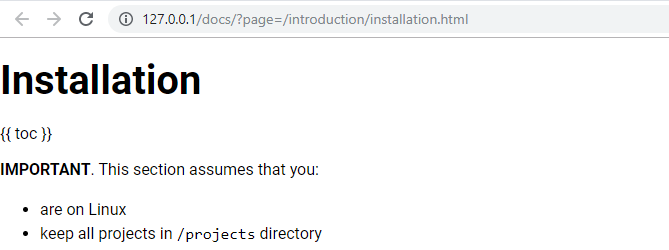

# Lesson 4. Displaying HTML Content #

We already know how to find proper documentation file by HTTP query parameter.
Now we need to display the content of this file converting Markdown text to HTML format. 

This lesson will show you  

- how to add new external library to the project
- how to use layers, views and template to generate full HTML page 

Expected Result
----------------------------------------

Application should find a file according to HTTP query parameter and display HTML content of it:

<http://127.0.0.1/docs/?page=/introduction/installation.html>

Understanding Rendering
----------------------------------------

Before digging into tutorial steps, let's review how HTML rendering works in Dubysa first.

Dubysa comes with standard set of page components: menu bar, button, input control, popup menu, dialog box, snack bar message and more. These components are called **views**. It is also easy to define custom views.

Individual views can be composed into larger views, those - into even larger views. Topmost views are composed into HTML page (which is also view).
 
This hierarchical view tree is called **layout** of the page.

The layout is rarely created all in one step. Instead, some base layout is defined in the first step, then the second and further steps add more and more details to it (add child views, modify properties of existing views and more). Layout creation steps are called **layers**.
 
**Rendering** is just creating the layout and converting it into HTML string. 

For more information on views and layers, see [Rendering](../../web-development/rendering.html).

Steps To Implement:
----------------------------------------

{{ toc }}

## Adding External Composer Library `michelf/php-markdown` To Work With Markdown Files 

Stop [`npm run watch`](../../php-development/dubysa-console-commands#npm-run-watch) if it is running.

We will use external `michelf/php-markdown` [Composer](../../integrations/composer-integration/) 
library to convert Markdown files to HTML. Now we need to include it to our project as required library.

Open command line, go to project directory and run
[`composer require`](../../php-development/dubysa-console-commands#composer-require) 
command:

    composer require "michelf/php-markdown" --no-scripts

This command will download newest version of required library and regenerate 
Composer package autoload.
 
After command is finished can check that `michelf/php-markdown` is added to `required` 
block of project's `composer.json` file. Here is an example of this block:

    "require": {
        "php": ">=7.1.0",
        "dubysa/framework": "0.4.*",
        "michelf/php-markdown": "^1.8"
    },

## Creating `Page` Class To Store Application Logic For File Processing

Let's create new `Page` class to keep all application logic related to page processing.  
Create `app/src/Docs/Page.php` file:

    <?php
    
    namespace App\Docs;
    
    use Manadev\Core\Object_;
    use Michelf\MarkdownExtra;
    
    /**
     * @property string $name @required @part
     * @property string $original_text @required @part
     * @property string $title @required @part
     * @property string $html @required @part
     */
    class Page extends Object_
    {
        const H1_PATTERN = "/^#\\s*(?<title>[^#{]+)/u";
    
        protected function default($property) {
            switch ($property) {
                case 'title':
                    return $this->getTitle();
                case 'original_text':
                    return file_get_contents($this->name);
                case 'html':
                    return MarkdownExtra::defaultTransform($this->original_text);
            }
    
            return parent::default($property);
        }
    
        protected function getTitle() {
            foreach (explode("\n", $this->original_text) as $line) {
                if (preg_match(static::H1_PATTERN, $line, $match)) {
                    return trim($match['title']);
                }
            }
            return '';
        }
    }

First of all you see that we have 4 class properties:

- `name` - file name. This property will be set outside the class and will be used to define other class properties
- `original_text` - original content of the Markdown file
- `html` - HTML content of the file. We will use `Michelf\MarkdownExtra` class to transform Markdown text to HTML.
- `title` - page title according to header in Markdown file. 

`default()` function is a standard way in Dubysa to set initial values for [properties, calculated on first access (AKA lazy properties)](../../architecture/properties#properties-calculated-on-first-access-aka-lazy-properties).
In this class initial property values are calculated in this way:
 
- to get original content of the file to `$original_text` property, standard PHP `file_get_contents()` function is used
- `MarkdownExtra::defaultTransform` converts file content to HTML text and is set to `$html` property.
- for `$title` property we will call new function `getTitle()` to find first level header in the file 
by regular expression. `H1_PATTERN` regexp will be used to find the text inside single `#` characters 
in the original file

## Modifying `Frontend` Controller Class   

In previous lessons application was sending plain text as a response for the browser. In this lesson we will use layers and views instead. So we replace plain text rendering with call to `m_layout()` function in `show()` controller method. Also, we will use `Page` class created in previous section:  

Here is new content of `app/src/Docs/Controllers/Frontend.php`:

    <?php
    
    namespace App\Docs\Controllers;
    
    use App\Docs\Page;
    use App\Docs\Hints\SettingsHint;
    use App\Docs\Views\Html;
    use Manadev\Core\App;
    use Manadev\Framework\Http\Controller;
    use Manadev\Framework\Settings\Settings;
    use Manadev\Framework\Http\Exceptions\NotFound;
    
    /**
     * @property Settings|SettingsHint $settings @required
     * @property string $doc_root @required
     * @property string $url @required
     */
    class Frontend extends Controller
    {
        protected function default($property) {
            global $m_app; /* @var App $m_app */
    
            switch ($property) {
                case 'settings':
                    return $m_app->settings;
                case 'doc_root':
                    return $this->settings->doc_root;
                case 'url':
                    return $m_app->query['page'];
            }
    
            return parent::default($property);
        }
    
        public function show() {
            $page = $this->findFile();
    
            return m_layout(
                [
                    '@include' => 'base',
                    '#page' => [
                        'title' => $page->title,
                        'content' => Html::new(['page' => $page]),
                    ],
                ]
            );
        }
    
        protected function findFile() {
    
            // read incoming query parameter 'page'
            $url = $this->url;
    
            if ($url === '/') {
                // home page is rendered from 'index.md'
                if (is_file($filename = $this->doc_root . '/index.md')) {
                    return Page::new(['name' => $filename]);
                }
            }
    
            if (mb_strrpos($url, '.html') !== mb_strlen($url) - mb_strlen('.html')) {
                // if page URL doesn't end with configured '.html' suffix, show that page is not found
                throw new NotFound(m_("Documentation page ':page' not found", ['page' => $this->url]));
            }
    
            // page URL ends with '.html' suffix. Remove suffix from URL
            $url = mb_substr($url, 0, mb_strlen($url) - mb_strlen('.html'));
    
            // handle page path. There should always be at least one '/' in URL as all page URLs start with '/'.
    
            // find position of last '/' in URL and define path and filename
            $pos = mb_strrpos($url, '/');
            $path = $this->doc_root . mb_substr($url, 0, $pos);
            $filename = mb_substr($url, $pos + 1);
    
            // if path is not a directory or filename is empty, show that page is not found
            if (!is_dir($path) || !$filename) {
                throw new NotFound(m_("Documentation page ':page' not found", ['page' => $this->url]));
            }
    
            // iterate through all files in 'path' directory and find file with or without preceding sort order.
            foreach (new \DirectoryIterator($path) as $fileInfo) {
                // skip '.' and '..' directory items
                if ($fileInfo->isDot() || $fileInfo->isDir()) {
                    continue;
                }
    
                if (preg_match("/(?:\\d+-)?" . preg_quote($filename) . "\\.md/u", $fileInfo->getFilename())) {
                    return Page::new(['name' => "{$path}/{$fileInfo->getFilename()}"]);
                    }
                }
    
            // If underlying directory doesn't exist we return that page doesn't exist
            throw new NotFound(m_("Documentation page ':page' not found", ['page' => $this->url]));
        }
    }

First of all check `findFile()` function. Now it returns not just simple file name, 
but the object of `App\Docs\Page` class.
In previous section we had created this class with four properties: `name`, `title`, `text` and `html`. 
Now we will use them.

The main change in current class is done in `show()` function. 
Now it returns a [layout](../../web-development/rendering.html), created using `m_layout()` function, with an anonymous layer containing two layout instructions:

- `'@include' => 'base'` adds all layout instructions from `base` layer. It will provide proper HTML structure as a basis for further modifications.
- `'#page' => ` modifies `page` view provided by `base` layer by adding or redefining its `title` and `content` properties.
  - we redefine HTML page title to be calculated by `App/Docs/Page` class as first level heading in source file
  - `content` property will contain new instance of `Html` view. `Html` view doesn't exit yet, we will created in next step, for now let's keep in mind that it will use `$page` object as an input to generate HTML view.   

## Creating New `Html` View

In `App/Docs/Controllers/Frontend::show()` method we have just used the view class which is not exist yet. 
Let's create it. 

Create new directory `Views` under our module and create new PHP class `App\Docs\Views\Html` 
in file `app/src/Docs/Views/Html.php`:

    <?php
    
    namespace App\Docs\Views;
    
    use App\Docs\Page;
    use Manadev\Framework\Views\View;
    
    /**
     * @property Page $page @required
     */
    class Html extends View
    {
        public $template = 'App_Docs.html';
    }

This class has `page` property filled in by controller class.

This class extends standard Dubysa `View` class and assign new template, we'll create a moment later, 
to `$template` property. 

## Creating New `App_Docs.html` View Template 

We will create new template for our project, `App_Docs.html`, mentioned in previous step.  

Create new directory `frontend/views` and new PHP file 
`app/src/Docs/frontend/views/html.blade.php`.

Here is the content of the file:

    <?php
    /* @var \App\Docs\Views\Html $view */
    ?>
    {!! $view->page->html !!}

Template variable `$view` is the object of `Html` class type having only one `page` property.
This template output `html` property of the page. 

`{!! !!}` is used to render property value as is, without character **escaping**.

## Restarting `npm run watch`

Start [`npm run watch`](../../php-development/dubysa-console-commands#npm-run-watch).

If it was running, stop it and start again.
This is needed because we added new resource directory and this process should include this folder into watching.

Conclusion
----------------------------------------

Check if document HTML content is shown when appropriate URL is entered in the browser. 

In this lesson we modified controller to show the layer which uses a view, which uses template from his side. 

We advice to read more about [web development in Dubysa](../../web-development/) to have deeper understanding 
of it. 