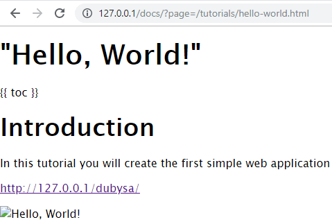
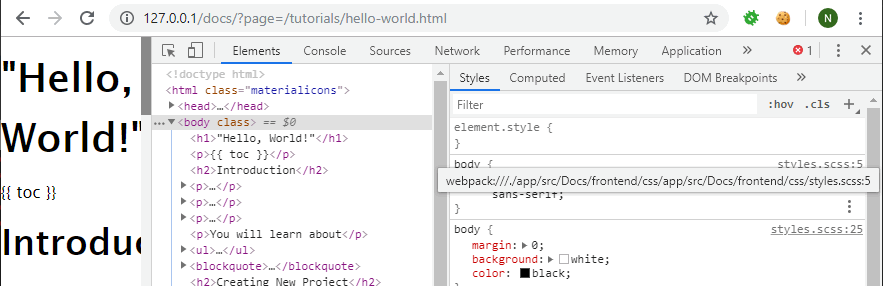

# Lesson 5. Adding CSS #

Application already shows HTML page applying standard CSS provided by Dubysa.

However, we want to have a possibility to customize it.

In this lesson you will find how to add custom CSS to the application.

Expected Result
----------------------------------------

After the changes we should see the page shown with another font and with customized formatting:

<http://127.0.0.1/docs/?page=/tutorials/hello-world.html>

Before applying custom CSS:

After applying custom CSS:

How CSS Styles Are Added To Page
----------------------------------------

Every page includes a single CSS file, you can see it in page source:

	<link rel="stylesheet" href="http://127.0.0.1/docs/development/frontend/Manadev_Blank/styles.css?v=Inl7M1zp">

This link contains a lot of details which are not important for this tutorial. For now it is enough to understand that CSS file is only one for the whole site.

This CSS file is generated when you run `npm run webpack` command or auto-updated if `npm run watch` command is running. 

Every module of the application can contribute its own CSS styles to this generated file. In order to contribute, module should declare its styles in `frontend/css/styles.scss` file.   

As you probably noticed, module CSS style files use [SASS syntax](https://sass-lang.com/).

Steps To Implement:
----------------------------------------

{{ toc }}

## Adding Module Specific Style `styles.scss` 

Let's add CSS styling for our module.

To do this first create directory `app/src/Docs/frontend/css` and new file 
`app/src/Docs/frontend/css/styles.scss`. Here is proposed content of this file:

    * {
      box-sizing: border-box;
    }
    
    body {
      font: 16px/1.5 "Lucida Sans Unicode", "Lucida Grande", sans-serif;
    }
    
    a, code {
      overflow-wrap: break-word;
      word-break: break-all;
    }
    
    pre {
      overflow: auto;
    }
    
    blockquote {
      margin: 0 0 15px;
      padding-left: 10px;
      border-left: 4px solid #ccc;
    }
    
    .icons {
      list-style: none;
      margin: 0;
      padding: 0;
      display: flex;
      flex-wrap: wrap;
    
      & > li .icon {
        margin: 5px;
        padding: 10px;
        border: 1px solid #c0c0c0;
        border-radius: 10px;
        text-align: center;
    
        a.image {
          display: inline-block;
        }
    
        ul {
          list-style: none;
          margin: 0;
          padding: 0;
        }
      }
    }
    
    @media (min-width: 768px) {
      .icons > li {
        width: 50%;
      }
    }
    
    @media (min-width: 992px) {
      .icons > li {
        width: 33.333333%;
      }
    }
    
    @media (min-width: 1200px) {
      .icons > li {
        width: 25%;
      }
    }

It is ready-to-use responsive styling for the light theme of documentation portal. 
Definitely, it can be improved, modified by you to provide the design you want to have.

## Restarting `npm run watch`

We should restart [`npm run watch`](../../php-development/dubysa-console-commands#npm-run-watch) process,
because we just added new `styles.scss` file which is not known to Webpack yet.

Conclusion
----------------------------------------

If all is done correctly you can find that application page font is changed. 

Bonus!
----------------------------------------

You can check by inspecting `body` class in browser developer tools, that applied style is coming 
from `app/src/Docs/frontend/css/styles.scss`:

As you can notice, Web Developer Tools give you the possibility to see exact `scss` source file introducing every CSS rule. 

This browser feature is known as **source map**. Dubysa not only generates merged `styles.css` file, but also `styles.css.map` file containing exact location of every generated line in module source files. 

You can check both generated files in  
`public/development/frontend/Manadev_Blank/styles.css` and `public/development/frontend/Manadev_Blank/styles.css.map`. 
