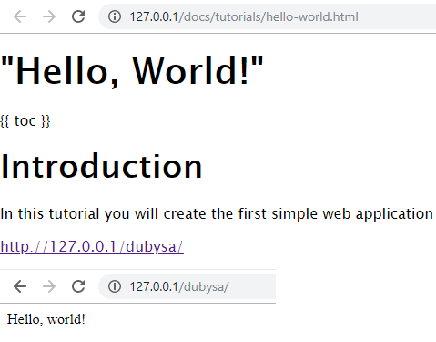

# Lesson 7. Handling Images

In this lesson, we will add support of images in text.

Markdown syntax already supports images. You can add an image anywhere in the text, let's say in <http://127.0.0.1/docs/tutorials/hello-world.html>:

	

This syntax is translated into `` HTML tag:

	

Browser understands relative link `hello-world.png` as `http://127.0.0.1/docs/tutorials/hello-world.png` which by default is served from project's `public` directory, namely `public/tutorials/hello-world.png`. Our pages and images, are not stored in project's `public` directory, so browser will get `404 - not found` response.

That's the problem we will solve in this lesson. 

Similarly as in previous lesson, we will handle requests like `tutorials/hello-world.png` in PHP code and serve them from directory specified in `doc_root` setting. 

Expected Result
----------------------------------------

Application should find an image and display in in the page:

<http://127.0.0.1/docs/tutorials/hello-world.html>

Steps To Implement:
----------------------------------------

{{ toc }}

## Modifying `DetectRouteTrait` Trait 

We will further improve `DetectRouteTrait` which we introduced in previous lesson. 

Currently, it let's detect route for incoming request by original `DetectRoute` class and if it can't tries to find `.md` file matching incoming request in `doc_root` directory.

We will add, that if `.md` file is not found, we will try to find image file in the same `doc_root` directory:

    if ($image = $imageFinder->findImage($request->route)) {
        $module->image = $image;

        return Frontend::new(['route' => '/_image', 'method' => 'image'], null,
            $m_app->area_->controllers);
    }

Again, as with detecting `.md` file we introduce here new class for detecting if incoming request asks for image and if such an image exists in the `doc_root` directory. This new class will be implemented in next step.

Full content of `app/src/Docs/Traits/DetectRouteTrait.php`:

    <?php
    
    namespace App\Docs\Traits;
    
    use App\Docs\Controllers\Frontend;
    use App\Docs\ImageFinder;
    use App\Docs\Module;
    use App\Docs\PageFinder;
    use Manadev\Core\App;
    use Manadev\Framework\Http\Exceptions\NotFound;
    
    trait DetectRouteTrait
    {
        protected function around_findController(callable $proceed) {
            global $m_app; /* @var App $m_app */
    
            try {
                return $proceed();
            }
            catch (NotFound $e) {
                $module = $m_app->modules['App_Docs']; /* @var Module $module */
                $request = $m_app->request;
                $pageFinder = $m_app[PageFinder::class]; /* @var PageFinder $pageFinder */
                $imageFinder = $m_app[ImageFinder::class]; /* @var ImageFinder $imageFinder */
    
                if ($request->method != 'GET') {
                    throw $e;
                }
    
                if ($page = $pageFinder->find($request->route)) {
                    $module->page = $page;
    
                    return Frontend::new(['route' => '/', 'method' => 'show'], null, $m_app->area_->controllers);
                }
    
                if ($image = $imageFinder->findImage($request->route)) {
                    $module->image = $image;
    
                    return Frontend::new(['route' => '/_image', 'method' => 'image'], null,
                        $m_app->area_->controllers);
                }
    
                throw $e;
            }
        }
    
    }

## Adding New Class `ImageFinder`

`app/src/Docs/ImageFinder.php`:

    <?php
    
    namespace App\Docs;
    
    use App\Docs\Hints\SettingsHint;
    use Manadev\Core\App;
    use Manadev\Core\Object_;
    use Manadev\Framework\Settings\Settings;
    
    /**
     * @property Settings|SettingsHint $settings @required
     * @property string $doc_root @required
     */
    class ImageFinder extends Object_
    {
        protected function default($property) {
            global $m_app; /* @var App $m_app */
    
            switch ($property) {
                case 'settings':
                    return $m_app->settings;
                case 'doc_root':
                    return $this->settings->doc_root;
            }
    
            return parent::default($property);
        }
    
        public function findImage($url) {
            if (!in_array(strtolower(pathinfo($url, PATHINFO_EXTENSION)), Page::IMAGE_EXTENSIONS)) {
                return null;
            }
    
            $result = $this->doc_root . $url;
            return is_file($result) ? $result : null;
        }
    }
    
The only public method of new class, `findImage()` returns full image file name, if incoming URL denotes image and if the image was found, or `null` otherwise.   

This class also has same properties `settings` and `doc_root` as `App\Docs\PageFinder` class. 
We are using `doc_root` property to get absolute image file name.

## Adding Module Global Variable `image`

We used module global variable `image` in `DetectRouteTrait` to store file name of the image currently being served. Let's add it to the module properties in `app/src/Docs/Module.php`:
	
	<?php
	
	namespace App\Docs;
	
	use Manadev\Core\Modules\BaseModule;
	use Manadev\Framework\Http\Advices\DetectRoute;
	
	/**
	 * @property Page $page @required
	 * @property string $image @required Absolute file name
	 */
	class Module extends BaseModule
	{
	    public $traits = [
	        DetectRoute::class => Traits\DetectRouteTrait::class,
	    ];
	
	}

## Modifying `routes.php`

We already mentioned new route `GET /_image`, now it is time to define it in `app/src/Docs/config/frontend/routes.php`:

	<?php
	
	use App\Docs\Controllers\Frontend;
	
	return [
	    'GET /' => [
	        'class' => Frontend::class,
	        'method' => 'show',
	        'abstract' => true,
	    ],
	
	    'GET /_image' => [
	        'class' => Frontend::class,
	        'method' => 'image',
	        'abstract' => true,
	    ],
	];

## Modifying `Frontend` Controller

Let's add image processing method into `Frontend` Controller.
Here is a new content of `app/src/Docs/Controllers/Frontend.php`:

    <?php
    
    namespace App\Docs\Controllers;
    
    use App\Docs\Module;
    use App\Docs\Page;
    use App\Docs\Views\Html;
    use Manadev\Core\App;
    use Manadev\Framework\Http\Controller;
    use Manadev\Framework\Http\Responses;
    
    /**
     * @property Page $page @required
     * @property Module $module @required
     * @property Responses $responses @required
     */
    class Frontend extends Controller
    {
        protected function default($property) {
            global $m_app; /* @var App $m_app */
    
            switch ($property) {
                case 'module':
                    return $m_app->modules['App_Docs'];
                case 'page':
                    return $this->module->page;
                case 'responses':
                    return $m_app[Responses::class];
            }
    
            return parent::default($property);
        }
    
        public function show() {
            return m_layout(
                [
                    '@include' => 'base',
                    '#page' => [
                        'title' => $this->page->title,
                        'content' => Html::new(['page' => $this->page]),
                    ],
                ]
            );
        }
    
        public function image() {
            return $this->responses->image($this->module->image);
        }
    }

We use `image` function in `vendor/dubysa/framework/src/Framework/Http/Responses.php`, which prepares HTTP response for the image, 
providing important data for the browser, for example, `content-type` and `content-disposition` . 

Conclusion
----------------------------------------

After all steps are finished, check if you can see images in the page where it should be.
