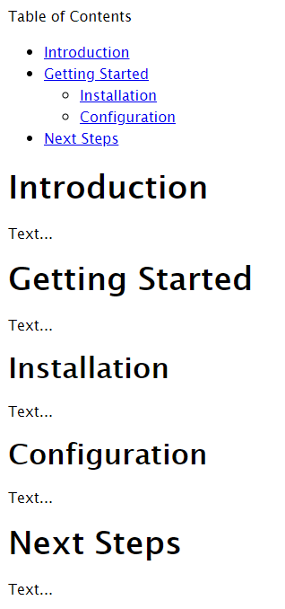
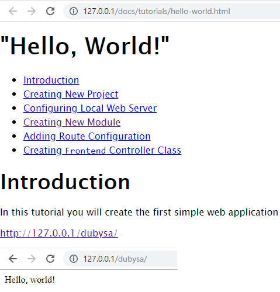

# Lesson 8. Generating Table Of Contents #

In this lesson we will process the table of contents placeholder and replace it with actual table of contents for the page. Placeholder syntax: 

    {{ toc depth="2" }}

Without optional `depth` parameter, we will add all headers of 2-nd, 3-rd and deeper levels into table of contents. 

Optional `depth` parameter specifies how many levels of headers should be included into table of contents.

How To Create Table of Contents Manually
----------------------------------------

Headers in Markdown are marked with hash (`#`) character string, placed before header text. 
The number of hash characters defines the level of the header.
There should be a space between string of hashes and the text. 

For example:

    # Header 1
    ## Header 2
    ### Header 3 
    #### Header 4

Table of contents is a multilevel list of headers, starting from second level. 
Element in the table of contents is a list item with the relative link to go to the listed header.
We can use [Markdown Extra syntax](https://michelf.ca/projects/php-markdown/extra/#spe-attr) to assign id to the header 
HTML element and use the same id in the table of content. 

Here is example of the Markdown document, where table of contents is placed before the main text 
and headings having assigned identifiers:

    Table of Contents
     
    * [Introduction](#introduction)
    * [Getting Started](#getting-started)
        * [Installation](#installation)
        * [Configuration](#configuration)
    * [Next Steps](#next-steps)
    
    ## Introduction {#introduction}
    
    Text...
    
    ## Getting Started {#getting-started}
    
    Text...
    
    ### Installation {#installation}
    
    Text...
    
    ### Configuration {#configuration}
    
    Text...
    
    ## Next Steps {#next-steps}
    
    Text...

If we preprocess our Markdown text in this manner, placing identifiers and replacing `{{ toc }}` snippet, 
it will be converted to HTML like in the picture below:

Generating Table Of Contents Automatically 
----------------------------------------

We will generate table of contents in 2 phases:

1. Assign identifiers to headers. 
2. Replace `{{ toc }}` placeholder with the list of links to the headers. 

Expected Result
----------------------------------------

Application should show table of contents in the page:

<http://127.0.0.1/docs/tutorials/hello-world.html>

Steps To Implement:
----------------------------------------

{{ toc }}

## Modifying `Page` Class 

Lets add assignment of header ids and generation of table of contents to the `Page` class, which reads documentation source Markdown file and converts it 
to HTML. 

Here is new content of `app/src/Docs/Page.php`:

    <?php
    
    namespace App\Docs;
    
    use Osm\Core\App;
    use Osm\Core\Object_;
    use Michelf\MarkdownExtra;
    
    /**
     * @property string $name @required @part
     * @property string $original_text @required @part
     * @property string $text @required @part
     * @property string $title @required @part
     * @property string $html @required @part
     * @property array $tags @required
     * @property TagRenderer $tag_renderer @required
     */
    class Page extends Object_
    {
        const H1_PATTERN = "/^#\\s*(?<title>[^#{]+)/u";
        const HEADER_PATTERN = "/^(?<depth>#+)\\s*(?<title>[^#{\\r\\n]+)#*[ \\t]*(?:{(?<attributes>[^}\\r\\n]*)})?\\r?$/mu";
        const TAG_PATTERN = "/(?<whitespace> {4})?(?<opening_backtick>`)?{{\\s*(?<tag>[^ }]*)(?<args>.*)}}(?<closing_backtick>`)?/u";
        const ARG_PATTERN = "/(?<key>[a-z0-9_]+)\\s*=\\s*\"(?<value>[^\"]*)\"/u";
        const ID_PATTERN = "/#(?<id>[^ ]+)/u";
    
        const IMAGE_EXTENSIONS = ['png', 'jpg', 'gif'];
    
        const CHARS_BEING_REPLACED = [
            // characters listed below when found in SEOified text are replaced by SEO friendly characters from
            // REPLACEMENTS array. For example, ' ' ir replaced with '-'
            ' ', '\\', '/',
    
            // characters listed below when found in SEOified text are ignored, i.e. not put into generated URL
            '`', '"', '\'', '(', ')', '.', ',', '?', '!',
        ];
        const REPLACEMENTS = ['-', '-', '-'];
    
        protected function default($property) {
            global $osm_app; /* @var App $osm_app */
    
            switch ($property) {
                case 'title':
                    return $this->getTitle();
                case 'original_text':
                    return file_get_contents($this->name);
                case 'text':
                    return $this->transformText($this->original_text);
                case 'html':
                    return MarkdownExtra::defaultTransform($this->text);
                case 'tags':
                    return $osm_app->config('doc_tags');
                case 'tag_renderer':
                    return $osm_app[TagRenderer::class];
            }
    
            return parent::default($property);
        }
    
        protected function getTitle() {
            foreach (explode("\n", $this->original_text) as $line) {
                if (preg_match(static::H1_PATTERN, $line, $match)) {
                    return trim($match['title']);
                }
            }
            return '';
        }
    
        protected function transformText($text) {
            $text = $this->assignHeadingIds($text);
            $text = $this->processTags($text);
    
            return $text;
        }
    
        protected function assignHeadingIds($text) {
            $ids = [];
    
            return preg_replace_callback(static::HEADER_PATTERN, function($match) use (&$ids){
                $attributes = $match['attributes'] ?? '';
                if (mb_strpos($attributes, '#') !== false) {
                    return $match[0];
                }
    
                $id = $this->generateId($match['title'], $ids);
    
                return "{$match['depth']} {$match['title']} {$match['depth']} {#{$id} {$attributes}}";
            }, $text);
        }
    
        protected function generateId($title, &$ids) {
            $key = $id = str_replace(static::CHARS_BEING_REPLACED, static::REPLACEMENTS,
                mb_strtolower(trim($title)));
            for ($suffix = 1; ; $suffix++) {
                $key = $suffix > 1 ? "$id-$suffix" : $id;
                if (!isset($ids[$key])) {
                    break;
                }
            }
    
            $ids[$key] = true;
            return $key;
        }
    
        protected function processTags($text) {
            return preg_replace_callback(static::TAG_PATTERN, function($match) use ($text) {
                // don't expand tags in code block
                if (!empty($match['whitespace'])) {
                    return $match[0];
                }
    
                // don't expand tags in inline code
                if (!empty($match['opening_backtick']) && !empty($match['closing_backtick'])) {
                    return $match[0];
                }
    
                if (!($parameters = $this->tags[$match['tag']] ?? null)) {
                    return $match[0];
                }
    
                return $this->tag_renderer->render($this, $match['tag'], $text, $this->parseArgs($match['args'], $parameters))
                    ?? $match[0];
            }, $text);
        }
    
        /**
         * @param string $args
         * @param string[] $parameters
         * @return array
         */
        protected function parseArgs($args, $parameters) {
            $result = [];
    
            if (!preg_match_all(static::ARG_PATTERN, $args, $matches)) {
                return $result;
            }
    
            foreach (array_keys($matches[0]) as $index) {
                $key = $matches['key'][$index];
                $value = $matches['value'][$index];
    
                if (!in_array($key, $parameters)) {
                    continue;
                }
    
                $result[$key] = intval($value);
            }
    
            return $result;
        }
    }

First of all, we introduced new `text` property to store preprocessed Markdown text.
This property is calculated by `transformText()` method by taking original text, 
assigning header identifiers in `assignHeadingIds()` method and generating table of content in `processTags()` method.

At first, `assignHeadingIds()` method finds header using `HEADER_PATTERN` regex and then generates unique id 
based on header text by replacing  `' '`, `'\'`, `'/'` with `'-'`, skipping several not SEO friendly characters 
and changing the text to lowercase.

`processTags()` method finds table of contents tag `{{ toc }}` using `TAG_PATTERN` regex.
To have more extensible solution we will not use hardcoded tag name here, but rather define it in the module configuration, 
described in next section. If tag is found, we will call `render()` method of new `TagRenderer` class passing tag arguments as well.

## Creating Module `doc_tags` Settings

Create new file `app/src/Docs/config/doc_tags.php`:

    <?php
    
    return [
        'toc' => ['depth'],
    ];

Like all other configuration, this file returns an array. `doc_tags.php` file returns an array of all supported tags and tag arguments.
Right now we have only one supported tag `toc` with only one supported optional argument `depth`.

## Creating `TagRendering` Class

Create new class `app/src/Docs/TagRenderer.php`:

    <?php
    
    namespace App\Docs;
    
    use Osm\Core\App;
    use Osm\Core\Exceptions\NotSupported;
    use Osm\Core\Object_;
    
    /**
     * @property Page $page @temp
     * @property string $text @temp
     * @property array $args @temp
     */
    class TagRenderer extends Object_
    {
        /**
         * @param Page $page
         * @param string $tag
         * @param string $text
         * @param array $args
         * @return string
         */
        public function render(Page $page, $tag, $text, $args) {
            $this->page = $page;
            $this->text = $text;
            $this->args = $args;
    
            switch ($tag) {
                case 'toc': return $this->renderToc();
                default:
                    throw new NotSupported(m_("Tag ':tag' not supported", ['tag' => $tag]));
            }
        }
    
        protected function renderToc() {
            $result = "\n";
            foreach (explode("\n", $this->text) as $line) {
                if (!preg_match(Page::HEADER_PATTERN, $line, $match)) {
                    continue;
                }
    
                $depth = strlen($match['depth']) - 2;
                if ($depth < 0) {
                    continue;
                }
    
                if (isset($this->args['depth']) && $depth >= $this->args['depth']) {
                    continue;
                }
    
                if (!isset($match['attributes'])) {
                    continue;
                }
    
                if (!preg_match(Page::ID_PATTERN, $match['attributes'], $idMatch)) {
                    continue;
                }
    
                $title = trim($match['title']);
    
                $result .= str_repeat(' ', $depth * 4);
                $result .= "* [" . $title . "](#{$idMatch['id']})\n";
            }
    
            return "{$result}\n";
        }
    }

Public `render()` method calls `renderToc()` method for `toc` tag, which generates a string with table of content.
Headers already has assigned identifiers, so, we do processing for each header with depth less or equal 
than `depth` argument, as specified in `{{ toc }}` snippet:

* adding additional indent to the title depending on level;
* generating unordered list item containing link to the header.

Conclusion
----------------------------------------

Check if `{{ toc }}` snippet is replaced with table of content on your page.