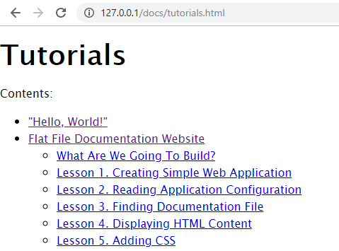

# Lesson 9. Generating Child Page Tree

For higher-level pages it is reasonable to show the tree of child pages similar to table of content, 
which was show in previous lesson.

In this lesson we will process the child page placeholder and replace it with the tree 
of child pages. Placeholder syntax: 

    {{ child_pages depth="2" }}

Without optional `depth` parameter, we will add all child pages  of 2-nd, 3-rd and deeper levels into the tree. 

Optional `depth` parameter specifies how many levels of headers should be included into table of contents.

How Child Pages Are Organized
-----------------------------

Before starting this tutorial we agreed to follow the rules for 
[source documentation structure](what-we-are-going-to-build.html#source-documentation-structure).

If Markdown document is quite large, it is reasonable to split it to several child documents. 
Each child document, in turn, can also be split. This way document hierarchy is created.

For example, if we have large document

    /some-page.md

we can organize it in following manner:

    /some-page.md
    /some-page/
    /some-page/01-child-page-a.md        
    /some-page/02-child-page-b.md  
    /some-page/03-child-page-c.md      
    /some-page/child-page-c/
    /some-page/child-page-c/01-sub-page-d.md 
    /some-page/child-page-c/02-sub-page-e.md 
                
Expected Result
----------------------------------------

Application should show child page tree:

<http://127.0.0.1/docs/tutorials.html>

Steps To Implement:
----------------------------------------

{{ toc }}
    
## Adding Configuration Into `doc_tags` Settings

Add new `child_pages` tag into `app/src/Docs/config/doc_tags.php`:

    <?php
    
    return [
        'toc' => ['depth'],
        'child_pages' => ['depth'],
    ];
    
Like existing `toc` tag, new `child_pages` tag will have same optional argument `depth`. 

## Modifying `TagRendering` Class

We should process the `child_pages` tag in the same class where `toc` tag is processed.
Modify the class `app/src/Docs/TagRenderer.php`:

    <?php
    
    namespace App\Docs;
    
    use Osm\Core\App;
    use Osm\Core\Exceptions\NotSupported;
    use Osm\Core\Object_;
    
    /**
     * @property Page $page @temp
     * @property string $text @temp
     * @property array $args @temp
     *
     * @property PageFinder $page_finder @required
     */
    class TagRenderer extends Object_
    {
        protected function default($property) {
            global $osm_app; /* @var App $osm_app */
    
            switch ($property) {
                case 'page_finder': return $osm_app[PageFinder::class];
            }
    
            return parent::default($property);
        }
    
        /**
         * @param Page $page
         * @param string $tag
         * @param string $text
         * @param array $args
         * @return string
         */
        public function render(Page $page, $tag, $text, $args) {
            $this->page = $page;
            $this->text = $text;
            $this->args = $args;
    
            switch ($tag) {
                case 'toc': return $this->renderToc();
                case 'child_pages': return $this->renderChildPages();
                default:
                    throw new NotSupported(m_("Tag ':tag' not supported", ['tag' => $tag]));
            }
        }
    
        protected function renderToc() {
            $result = "\n";
            foreach (explode("\n", $this->text) as $line) {
                if (!preg_match(Page::HEADER_PATTERN, $line, $match)) {
                    continue;
                }
    
                $depth = strlen($match['depth']) - 2;
                if ($depth < 0) {
                    continue;
                }
    
                if (isset($this->args['depth']) && $depth >= $this->args['depth']) {
                    continue;
                }
    
                if (!isset($match['attributes'])) {
                    continue;
                }
    
                if (!preg_match(Page::ID_PATTERN, $match['attributes'], $idMatch)) {
                    continue;
                }
    
                $title = trim($match['title']);
    
                $result .= str_repeat(' ', $depth * 4);
                $result .= "* [" . $title . "](#{$idMatch['id']})\n";
            }
    
            return "{$result}\n";
        }
    
        protected function renderChildPages() {
            return $this->doRenderChildPages($this->page);
        }
    
        protected function doRenderChildPages(Page $parentPage, $depth = 0) {
            if (isset($this->args['depth']) && $depth >= $this->args['depth']) {
                return '';
            }
    
            $result = '';
    
            foreach ($this->page_finder->findChildPages($parentPage) as $page) {
                $result .= str_repeat(' ', $depth * 4);
                $result .= "* [" . $page->title . "]({$page->url})\n";
                $result .= $this->doRenderChildPages($page, $depth + 1);
            }
    
            return $result;
        }
    }
   
First of all, new case for `child_pages` is included into `render()` method.

Protected recursive `doRenderChildPages()` method will find all descendants of the current page.
It also stops deeper descendant page processing, if defined `depth` level is reached.

To create child page tree we need to get the array of all child pages. 
For this we will use new `findChildPages()` method of existing `PageFinder` class. It will be described below.

Child page tree is an unordered list of links to every child page, 
where link text is assigned from child page title, 
while reference should have URL to the page. 
Every link to child page can have additional indent depending on it's level.

To use child page URL in the tree, we need to be able to calculate `url` property of the page. 
This will be implemented in `Page` class  and described below.

## Modifying `PageFinder` Class

Here is the new content of `app/src/Docs/PageFinder.php` file:

    <?php
    
    namespace App\Docs;
    
    use App\Docs\Hints\SettingsHint;
    use Osm\Core\App;
    use Osm\Core\Exceptions\NotSupported;
    use Osm\Core\Object_;
    use Osm\Framework\Settings\Settings;
    
    /**
     * @property Settings|SettingsHint $settings @required
     * @property string $doc_root @required
     */
    class PageFinder extends Object_
    {
        protected function default($property) {
            global $osm_app; /* @var App $osm_app */
    
            switch ($property) {
                case 'settings':
                    return $osm_app->settings;
                case 'doc_root':
                    return $this->settings->doc_root;
            }
    
            return parent::default($property);
        }
    
        /**
         * Returns .md page file by URL or returns null if not found
         *
         * @param string $url
         * @return Page
         */
        public function find($url) {
            if ($url === '/') {
                // home page is rendered from 'index.md'
                if (is_file($filename = $this->doc_root . '/index.md')) {
                    return Page::new(['name' => $filename]);
                }
            }
    
            if (mb_strrpos($url, '.html') !== mb_strlen($url) - mb_strlen('.html')) {
                // if page URL doesn't end with configured '.html' suffix, show that page is not found
                return null;
            }
    
            // page URL ends with '.html' suffix. Remove suffix from URL
            $url = mb_substr($url, 0, mb_strlen($url) - mb_strlen('.html'));
    
            // handle page path. There should always be at least one '/' in URL as all page URLs start with '/'.
    
            // find position of last '/' in URL and define path and filename
            $pos = mb_strrpos($url, '/');
            $path = $this->doc_root . mb_substr($url, 0, $pos);
            $filename = mb_substr($url, $pos + 1);
    
            // if path is not a directory or filename is empty, show that page is not found
            if (!is_dir($path) || !$filename) {
                return null;
            }
    
            // iterate through all files in 'path' directory and find file with or without preceding sort order.
            foreach (new \DirectoryIterator($path) as $fileInfo) {
                // skip '.' and '..' directory items
                if ($fileInfo->isDot() || $fileInfo->isDir()) {
                    continue;
                }
    
                if (preg_match("/(?:\\d+-)?" . preg_quote($filename) . "\\.md/u", $fileInfo->getFilename())) {
                    return Page::new(['name' => "{$path}/{$fileInfo->getFilename()}"]);
                    }
                }
    
            // If underlying directory doesn't exist we return that page doesn't exist
            return null;
        }
    
        /**
         * @param Page $page
         * @return Page[]
         */
        public function findChildPages(Page $page) {
            $result = [];
    
            if ($page->name == $this->doc_root . '/index.md') {
                $path = $this->doc_root;
            }
            else {
                if (!preg_match(Page::FILENAME_PATTERN, basename($page->name), $match)) {
                    throw new NotSupported();
                }
    
                $path = dirname($page->name) . '/' . $match['name'];
            }
    
            if (!is_dir($path)) {
                return $result;
            }
    
            foreach (new \DirectoryIterator($path) as $fileInfo) {
                if ($fileInfo->isDot()) {
                    continue;
                }
    
                if (starts_with($fileInfo->getFilename(), '.')) {
                    continue;
                }
    
                if ($fileInfo->isDir()) {
                    continue;
                }
    
                // don't add root page itself to the children of root page
                if ($path == $this->doc_root && $fileInfo->getFilename() == 'index.md') {
                    continue;
                }
    
                if (preg_match(Page::FILENAME_PATTERN, $fileInfo->getFilename())) {
                    $result[] = Page::new(['name' => "{$path}/{$fileInfo->getFilename()}"]);
                }
            }
    
            usort($result, function(Page $a, Page $b) {
                if ($a->name < $b->name) return -1;
                if ($a->name > $b->name) return 1;
                return 0;
            });
    
            return $result;
        }
    }

New `findChildPages()` method returns the array of all child pages for the given page.

First, it tries to find the directory where child pages are stored. 
The name of the directory should match with the page name by `FILENAME_PATTERN` regex.

If directory is found, it iterates through all Markdown files in the directory, 
creates `Page` object for each file and adds to `result[]` array. 

Finally, `result[]` array is sorted by child page name, using `usort()` function.

## Modifying `Page` Class

Let's add new `url` property to the class. Here is modified content of `app/src/Docs/Page.php`:

    <?php
    
    namespace App\Docs;
    
    use Osm\Core\App;
    use Osm\Core\Object_;
    use Michelf\MarkdownExtra;
    
    /**
     * @property string $name @required @part Absolute file name
     * @property string $original_text @required @part
     * @property string $text @required @part
     * @property string $title @required @part
     * @property string $html @required @part
     * @property string $url @required
     *
     * @property array $tags @required
     * @property TagRenderer $tag_renderer @required
     * @property PageUrlGenerator $url_generator @required
     */
    class Page extends Object_
    {
        const H1_PATTERN = "/^#\\s*(?<title>[^#{]+)/u";
        const HEADER_PATTERN = "/^(?<depth>#+)\\s*(?<title>[^#{\\r\\n]+)#*[ \\t]*(?:{(?<attributes>[^}\\r\\n]*)})?\\r?$/mu";
        const TAG_PATTERN = "/(?<whitespace> {4})?(?<opening_backtick>`)?{{\\s*(?<tag>[^ }]*)(?<args>.*)}}(?<closing_backtick>`)?/u";
        const ARG_PATTERN = "/(?<key>[a-z0-9_]+)\\s*=\\s*\"(?<value>[^\"]*)\"/u";
        const ID_PATTERN = "/#(?<id>[^ ]+)/u";
        const FILENAME_PATTERN = "/(?:\\d+-)?(?<name>.*)\\.md/u";
    
        const IMAGE_EXTENSIONS = ['png', 'jpg', 'gif'];
    
        const CHARS_BEING_REPLACED = [
            // characters listed below when found in SEOified text are replaced by SEO friendly characters from
            // REPLACEMENTS array. For example, ' ' ir replaced with '-'
            ' ', '\\', '/',
    
            // characters listed below when found in SEOified text are ignored, i.e. not put into generated URL
            '`', '"', '\'', '(', ')', '.', ',', '?', '!',
        ];
        const REPLACEMENTS = ['-', '-', '-'];
    
        protected function default($property) {
            global $osm_app; /* @var App $osm_app */
    
            switch ($property) {
                case 'title':
                    return $this->getTitle();
                case 'original_text':
                    return file_get_contents($this->name);
                case 'text':
                    return $this->transformText($this->original_text);
                case 'html':
                    return MarkdownExtra::defaultTransform($this->text);
                case 'url':
                    return $this->url_generator->generateUrl($this);
    
                case 'tags':
                    return $osm_app->config('doc_tags');
                case 'tag_renderer':
                    return $osm_app[TagRenderer::class];
                case 'url_generator':
                    return $osm_app[PageUrlGenerator::class];
            }
    
            return parent::default($property);
        }
    
        protected function getTitle() {
            foreach (explode("\n", $this->original_text) as $line) {
                if (preg_match(static::H1_PATTERN, $line, $match)) {
                    return trim($match['title']);
                }
            }
            return '';
        }
    
        protected function transformText($text) {
            $text = $this->assignHeadingIds($text);
            $text = $this->processTags($text);
    
            return $text;
        }
    
        protected function assignHeadingIds($text) {
            $ids = [];
    
            return preg_replace_callback(static::HEADER_PATTERN, function($match) use (&$ids){
                $attributes = $match['attributes'] ?? '';
                if (mb_strpos($attributes, '#') !== false) {
                    return $match[0];
                }
    
                $id = $this->generateId($match['title'], $ids);
    
                return "{$match['depth']} {$match['title']} {$match['depth']} {#{$id} {$attributes}}";
            }, $text);
        }
    
        protected function generateId($title, &$ids) {
            $key = $id = str_replace(static::CHARS_BEING_REPLACED, static::REPLACEMENTS,
                mb_strtolower(trim($title)));
            for ($suffix = 1; ; $suffix++) {
                $key = $suffix > 1 ? "$id-$suffix" : $id;
                if (!isset($ids[$key])) {
                    break;
                }
            }
    
            $ids[$key] = true;
            return $key;
        }
    
        protected function processTags($text) {
            return preg_replace_callback(static::TAG_PATTERN, function($match) use ($text) {
                // don't expand tags in code block
                if (!empty($match['whitespace'])) {
                    return $match[0];
                }
    
                // don't expand tags in inline code
                if (!empty($match['opening_backtick']) && !empty($match['closing_backtick'])) {
                    return $match[0];
                }
    
                if (!($parameters = $this->tags[$match['tag']] ?? null)) {
                    return $match[0];
                }
    
                return $this->tag_renderer->render($this, $match['tag'], $text, $this->parseArgs($match['args'], $parameters))
                    ?? $match[0];
            }, $text);
        }
    
        /**
         * @param string $args
         * @param string[] $parameters
         * @return array
         */
        protected function parseArgs($args, $parameters) {
            $result = [];
    
            if (!preg_match_all(static::ARG_PATTERN, $args, $matches)) {
                return $result;
            }
    
            foreach (array_keys($matches[0]) as $index) {
                $key = $matches['key'][$index];
                $value = $matches['value'][$index];
    
                if (!in_array($key, $parameters)) {
                    continue;
                }
    
                $result[$key] = intval($value);
            }
    
            return $result;
        }
    }

New required property `url` will store the URL of the page and will be calculated using new `PageUrlGenerator` class. 
The content of the class is placed below.

As well, new `FILENAME_PATTERN` regex is added to find child page directory name from Markdown filename. 
It is used in `PageFinder` and `PageUrlGenerator` class.

## Creating `PageUrlGenerator` class

This class will generate URL for the page, based on source file name.

Create new PHP class `app/src/Docs/PageUrlGenerator.php`:

    <?php
    
    namespace App\Docs;
    
    use App\Docs\Hints\SettingsHint;
    use Osm\Core\App;
    use Osm\Core\Exceptions\NotSupported;
    use Osm\Core\Object_;
    use Osm\Framework\Http\Request;
    use Osm\Framework\Http\UrlGenerator;
    use Osm\Framework\Settings\Settings;
    
    /**
     * @property Settings|SettingsHint $settings @required
     * @property string $doc_root @required
     * @property UrlGenerator $url_generator @required
     * @property Request $request @required
     */
    class PageUrlGenerator extends Object_
    {
        protected function default($property) {
            global $osm_app; /* @var App $osm_app */
    
            switch ($property) {
                case 'settings':
                    return $osm_app->settings;
                case 'doc_root':
                    return $this->settings->doc_root;
                case 'url_generator':
                    return $osm_app[UrlGenerator::class];
                case 'request':
                    return $osm_app->request;
            }
    
            return parent::default($property);
        }
    
        public function generateUrl(Page $page) {
            if ($page->name == $this->doc_root . '/index.md') {
                $url = '/';
            }
            else {
                if (!preg_match(Page::FILENAME_PATTERN, basename($page->name), $match)) {
                    throw new NotSupported();
                }
    
                $url = strtr(mb_substr(dirname($page->name), mb_strlen($this->doc_root)), '\\', '/') .
                    '/' . $match['name'] . '.html';
            }
    
            return $this->url_generator->rawUrl('GET ' . $url, $this->request->query);
        }
    }

Public `generateUrl()` method calculate absolute URL from `page` object absolute file name.

At the very beginning, relative URL is calculated from file name. 
To get absolute URL we need to add base URL to calculated relative URL.

Base URL is defined from HTTP request, using `rawUrl()` method of `Osm\Framework\Http\UrlGenerator` class.
We also can have custom environment setting, for example `?_env=testing` and we need to use same environment setting 
for all child page URLs, therefore `$this->request->query` string is added at the end.

Conclusion
----------------------------------------

Check if `{{ child_pages }}` snippet is replaced with child page tree.

Get Lesson Source Code
----------------------------------------

1. Open command-line, go to the root project directory
2. Clone lesson branch from remote repository: 

        git clone git@bitbucket.org:natosme/docs_tutorial.git --branch lesson-09 lesson09
    
3. Navigate to new project directory and run scripts:

        cd lesson09
        composer run-script post-root-package-install
        composer update 
        
4. Configuration file does not exist in repository, so create new PHP file `config/settings.php`, 
modifying documentation source root, if needed:

        <?php
        
        return [
            'doc_root' => 'c:\_projects\osmphp\vendor\osmphp\framework\doc',
        ]; 

           