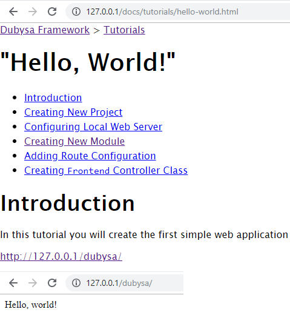

# Lesson 10. Displaying Breadcrumbs

In this lesson we will implement breadcrumbs, which is one of the type of web page navigation block. 
Breadcrumbs provide a quick links to higher-level pages as well showing the current location of the user 
within the documentation website’s hierarchy.  

Expected Result
----------------------------------------

Application should show breadcrumbs at the top of the page:

<http://127.0.0.1/docs/tutorials/hello-world.html>

Steps To Implement:
----------------------------------------

{{ toc }}

## Modifying `Frontend` Controller

Breadcrumbs navigation bar will be implemented as new `breadcrumbs` view in the page content.
To do this, we need to include this new view [rendering](../../web-development/rendering.html) into `Frontend` controller.

Modify `app/src/Docs/Controllers/Frontend.php`

    <?php
    
    namespace App\Docs\Controllers;
    
    use App\Docs\Module;
    use App\Docs\Page;
    use App\Docs\Views\Breadcrumbs;
    use App\Docs\Views\Html;
    use Osm\Core\App;
    use Osm\Framework\Http\Controller;
    use Osm\Framework\Http\Responses;
    use Osm\Framework\Views\Views\Container;
    
    /**
     * @property Page $page @required
     * @property Module $module @required
     * @property Responses $responses @required
     */
    class Frontend extends Controller
    {
        protected function default($property) {
            global $m_app; /* @var App $m_app */
    
            switch ($property) {
                case 'module':
                    return $m_app->modules['App_Docs'];
                case 'page':
                    return $this->module->page;
                case 'responses':
                    return $m_app[Responses::class];
            }
    
            return parent::default($property);
        }
    
        public function show() {
            return m_layout([
                '@include' => 'base',
                '#page' => [
                    'title' => $this->page->title,
                    'content' => Container::new([
                        'views' => [
                            'breadcrumbs' => Breadcrumbs::new(['page' => $this->page]),
                            'main' => Html::new(['page' => $this->page]),
                        ],
                    ]),
                ],
            ]);
        }
    
        public function image() {
            return $this->responses->image($this->module->image);
        }
    }
    
As you can see `show()` method is changed to set a container with 2 views instead of just setting one `Html` view.
For each view in the container we should provide the link to the page where the view will be shown.
'Breadcrumbs' view will be created in next section.     

## Creating New `Breadcrumbs` View
  
Create new PHP class `app/src/Docs/Views/Breadcrumbs.php`:

    <?php
    
    namespace App\Docs\Views;
    
    use App\Docs\Page;
    use App\Docs\PageFinder;
    use Osm\Core\App;
    use Osm\Framework\Views\View;
    
    /**
     * @property Page $page @required
     * @property Page[] $parent_pages @required
     * @property PageFinder $page_finder @required
     */
    class Breadcrumbs extends View
    {
        public $template = 'App_Docs.breadcrumbs';
    
        protected function default($property) {
            global $m_app; /* @var App $m_app */
    
            switch ($property) {
                case 'page_finder': return $m_app[PageFinder::class];
                case 'parent_pages': return $this->page_finder->findParentPages($this->page);
            }
            return parent::default($property);
        }
    }    
    
As you see, we need to have new `breadcrumbs` view template for this view. 
Template will be created in the next section.

This view should pass to `breadcrumbs` view template the array of higher-level parent pages related to current page.
Therefore new `parent_pages` property is defined. This array will be filled by `findParentPages` method of 
`PageFinder` class. This change will be described later in this lesson.
    
## Creating New `breadcrumbs` View Template 

Create new view template `app/src/Docs/frontend/views/breadcrumbs.blade.php`:

    <?php
    /* @var \App\Docs\Views\Breadcrumbs $view */
    ?>
    @if (count($view->parent_pages))
        

            <nav class="breadcrumbs__items">
                @foreach ($view->parent_pages as $page)
                    <a href="{{ $page->url }}">{{ $page->title }}</a>
                    @if (!$loop->last) &gt; @endif
                @endforeach
            </nav>
        

    @endif

The purpose of `breadcrumbs` view template is to provide HTML `
` where links to all parent pages 
starting from home are shown. Links are separated with “greater than” symbol `>`.

Each link is a `<a href>` element, providing absolute URL to parent page, where parent page title is used as a 
link text.

## Modifying `PageFinder` class

The existing `PageFinder` class provides functionality to find related pages, 
so it is the best place to implement collection of parent pages.

Here is the new content of `app/src/Docs/PageFinder.php`:

    <?php
    
    namespace App\Docs;
    
    use App\Docs\Hints\SettingsHint;
    use Osm\Core\App;
    use Osm\Core\Exceptions\NotSupported;
    use Osm\Core\Object_;
    use Osm\Framework\Settings\Settings;
    
    /**
     * @property Settings|SettingsHint $settings @required
     * @property string $doc_root @required
     */
    class PageFinder extends Object_
    {
        protected function default($property) {
            global $m_app; /* @var App $m_app */
    
            switch ($property) {
                case 'settings':
                    return $m_app->settings;
                case 'doc_root':
                    return $this->settings->doc_root;
            }
    
            return parent::default($property);
        }
    
        /**
         * Returns .md page file by URL or returns null if not found
         *
         * @param string $url
         * @return Page
         */
        public function find($url) {
            if ($url === '/') {
                // home page is rendered from 'index.md'
                if (is_file($filename = $this->doc_root . '/index.md')) {
                    return Page::new(['name' => $filename]);
                }
            }
    
            if (mb_strrpos($url, '.html') !== mb_strlen($url) - mb_strlen('.html')) {
                // if page URL doesn't end with configured '.html' suffix, show that page is not found
                return null;
            }
    
            // page URL ends with '.html' suffix. Remove suffix from URL
            $url = mb_substr($url, 0, mb_strlen($url) - mb_strlen('.html'));
    
            // handle page path. There should always be at least one '/' in URL as all page URLs start with '/'.
    
            // find position of last '/' in URL and define path and filename
            $pos = mb_strrpos($url, '/');
            $path = $this->doc_root . mb_substr($url, 0, $pos);
            $filename = mb_substr($url, $pos + 1);
    
            // if path is not a directory or filename is empty, show that page is not found
            if (!is_dir($path) || !$filename) {
                return null;
            }
    
            // iterate through all files in 'path' directory and find file with or without preceding sort order.
            foreach (new \DirectoryIterator($path) as $fileInfo) {
                // skip '.' and '..' directory items
                if ($fileInfo->isDot() || $fileInfo->isDir()) {
                    continue;
                }
    
                if (preg_match("/(?:\\d+-)?" . preg_quote($filename) . "\\.md/u", $fileInfo->getFilename())) {
                    return Page::new(['name' => "{$path}/{$fileInfo->getFilename()}"]);
                    }
                }
    
            // If underlying directory doesn't exist we return that page doesn't exist
            return null;
        }
    
        /**
         * @param Page $page
         * @return Page[]
         */
        public function findChildPages(Page $page) {
            $result = [];
    
            if ($page->name == $this->doc_root . '/index.md') {
                $path = $this->doc_root;
            }
            else {
                if (!preg_match(Page::FILENAME_PATTERN, basename($page->name), $match)) {
                    throw new NotSupported();
                }
    
                $path = dirname($page->name) . '/' . $match['name'];
            }
    
            if (!is_dir($path)) {
                return $result;
            }
    
            foreach (new \DirectoryIterator($path) as $fileInfo) {
                if ($fileInfo->isDot()) {
                    continue;
                }
    
                if (starts_with($fileInfo->getFilename(), '.')) {
                    continue;
                }
    
                if ($fileInfo->isDir()) {
                    continue;
                }
    
                // don't add root page itself to the children of root page
                if ($path == $this->doc_root && $fileInfo->getFilename() == 'index.md') {
                    continue;
                }
    
                if (preg_match(Page::FILENAME_PATTERN, $fileInfo->getFilename())) {
                    $result[] = Page::new(['name' => "{$path}/{$fileInfo->getFilename()}"]);
                }
            }
    
            usort($result, function(Page $a, Page $b) {
                if ($a->name < $b->name) return -1;
                if ($a->name > $b->name) return 1;
                return 0;
            });
    
            return $result;
        }
    
        public function findParentPages(Page $page) {
            if ($page->name === $this->doc_root . '/index.md') {
                return [];
            }
    
            $result = [Page::new(['name' => $this->doc_root . '/index.md'])];
    
            // $path always starts with '/'
            $url = strtr(mb_substr($page->name, mb_strlen($this->doc_root)), '\\', '/');
    
            for ($oldPos = 0, $pos = mb_strpos($url, '/', 1); $pos !== false;
                $oldPos = $pos, $pos = mb_strpos($url, '/', $pos + 1))
            {
                $path = $this->doc_root . mb_substr($url, 0, $oldPos);
                $name = mb_substr($url, $oldPos + 1, $pos - ($oldPos + 1));
    
                 foreach (new \DirectoryIterator($path) as $fileInfo) {
                    if ($fileInfo->isDot() || $fileInfo->isDir()) {
                        continue;
                    }
    
                    if (!preg_match(Page::FILENAME_PATTERN, $fileInfo->getFilename(), $match)) {
                        continue;
                    }
    
                    if ($match['name'] != $name) {
                        continue;
                    }
    
                     $result[] = Page::new(['name' => "{$path}/{$fileInfo->getFilename()}"]);
                     break;
                 }
            }
    
            return $result;
        }
    }

New method `findParentPages()` finds relative path of the current page from source file name 
and create `Page` object for each directory of this path. Finally, this method returns the array of all parent pages 
up to home page.

Conclusion
----------------------------------------

Check if breadcrumbs bar appeared at te top of the page.

Get Lesson Source Code Changes
----------------------------------------

<https://bitbucket.org/natosme/docs_tutorial/branches/compare/lesson-10%0Dlesson-09#diff>

Get Lesson Full Source Code
----------------------------------------

1. Open command-line, go to the root project directory
2. Clone lesson branch from remote repository: 

        git clone git@bitbucket.org:natosme/docs_tutorial.git --branch lesson-10 lesson10
    
3. Navigate to new project directory and run scripts:

        cd lesson10
        composer run-script post-root-package-install
        composer update 
        
4. Configuration file does not exist in repository, so create new PHP file `config/settings.php`, 
modifying documentation source root, if needed:

        <?php
        
        return [
            'doc_root' => 'c:\_projects\dubysa\vendor\dubysa\framework\doc',
        ]; 

